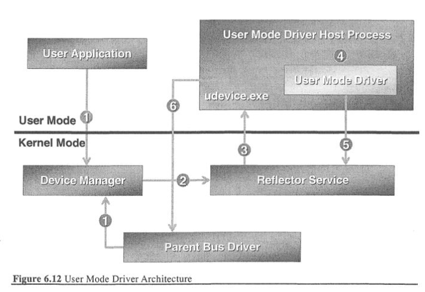

# Theory part 03/07/2014

## Point 1

### Question

(3.0 marks) What is a relative pathname? What is an absolute pathname? Why is it important for the kernel to know the current directory of the running process? What is the content of an inode? Why not keeping the inode information in the directory?

### Solution

Relative pathnames specify the location of files and directories in relative terms. The destination is reached by starting from the current working directory and following names of path tokens.

Absolute pathnames specify the location of files and directories in absolute terms. The destination is reached by starting from the (changed) root node and following names of path tokens. Absolute pathnames always begin with the `/` character, that identifies the root node.

The kernel needs to know the current directory of the running process in order to satisfy system calls that internally use the `namei` algorithm, because the path provided can be both absolute and relative.

The content of an inode (on disk) is:

* owner and owner group
* permissions (rad, write, execute) for owner, group and everyone
* link count
* the file size
* time informations:
  * last access
  * last file modification
  * last inode modification
* pointer to content blocks:
  * 10 direct blocks
  * 1 indirect, 1 double indirect and 1 triple indirect pointer to data blocks

The inode content is not stored into the directory because multiple links are possible to the same file, and consistency should be kept within multiple entries. Instead in the directory is stored only the name of the link and the inode number, that allows to reach the inode that is single for each file.

## Point 2

### Question

(3.0 marks) Which is the Unix command for copying an entire disk to another file? Give one or more examples. Explain which is the syntax, the options, and the function offered by the system call `losetup`. Give examples. Which is the difference between a raw and a block device?

### Solution

TODO

## Point 3

### Question

(3.0 marks) Given this reference string: `1233343251154323345241345`, compute the number of page faults and the mean resident set for the Page Fault Frequency strategy with control parameter `C=2`.

### Solution

TODO

## Point 4

### Question

(3.0 marks) Which are the roles of file pointers and of the overlapped structures in direct file access on WIN32 systems. Briefly describe common aspects and differences. The prototype of function `ReadFile` is:

```c
BOOL ReadFile (HANDLE hFile, LPVOID lpBuffer, DWORD nNumberOfBytesToRead,
    LPDWORD lpNumberOfBytesRead, LPOVERLAPPED lpOverlapped)
```

how can we handle pointers to large files? What is a `LARGE_INTEGER` type in Win32? How can we increment a `LARGE_INTEGER` variable by 1? Given a file of size 6 GB, containing records of fixed size 128 Bytes, how can we read record n. `2^15` (records are numbered starting from 0)?  
Provide the solution with file pointers and with overlapped structure.

### Solution

TODO

## Point 5

### Question

(3.0 marks) Explain the main differences between user and kernel mode drivers in WindowsCE and Windows Embedded 7. Given figure represented below, briefly describe the role of the user mode driver, of device manager and of the reflector service. What is `udevice.exe`? Is the user mode driver linked within the kernel (dynamically or statically)? When you write a used application, do you need to differentiate IO calls serviced by user mode drivers from those served by kernel mode drivers?



### Solution

TODO
