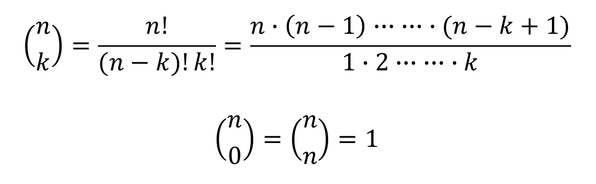
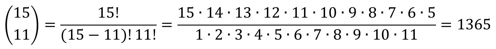

# Practice part 15/07/2014

The binomial coefficient is defined as:

`n` and `k` are integers, and `n >= k >= 0`.

For example 

Write a concurrentC program in the Unix environment which receives two arguments `n`, `k`, and computes and print the binomial coefficient.

The computation has to be performed in concurrency by a `numerator` thread a `denominator`: thread.

The `numerator` thread loops by taking **two factors at a time** that must be multiplied (for example `15` and `14`), computes their product, and save its result in its variable `numer`.

The same procedure is performed by the `denominator` threads, which save its result in its variable `denom`.

After the `numerator` and the `denominator` threads have performed their computation, **they must synchronize**: **one of them has to perform the division** of the partial contributions stored in `numer` and `denom`, and save it in a global variable `result`.

Then, `numerator` and `denominator` threads continue their job with the next pairs of factors that have not yet been processed.

Since it is possible that the number of remaining factors in the numerator and in the denominator is less than `2`, care has to be taken to synchronize the threads also considering this possibility, so that the synchronization among the `numerator` and `denominator` threads is correct and each thread can terminate.

**The main thread** will print the `result` of the binomial coefficient computation.