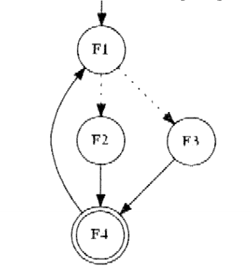

# Theory part 07/07/2017

## Point 1

### Question

(3.0 marks) Using counters and semaphores, write the pseudo-code synchronization **prologue and epilogue** of the **four functions** represented in the following precedence graph. Notice that **the nodes represent _functions_, not processes**. The graph imposes precedence on the function usage by an unknown set of processes. The template of the function is:

`F_i: {synchronization_prologue; F_i body; synchronization_epilogue}`



The meaning of this cyclic graph is the following:

- Initially a process can call function F1 without being blocked. Calls to any other function (F2, F3 or F4) will make the calling process block on a specific semaphore inside the function.
- When F1 returns, the same process or another process can proceed, executing F2 or F3 (possibly it was waiting inside F2 or F3), but will be blocked if it calls F4. The dotted edges mean **mutual exclusion** among processes executing F2 and F3.
- When either F2 or F3 has been executed, F4 can be executed without blocking the calling process, and any other process calling F1, F2 or F3 will be blocked.
- The meaning of the double circle for F4 is that F4 can be executed **in concurrency** by any number of processes as long as one of them is still inside the function.
- When the last concurrent process leaves F4, only F1 can be executed by a process without being blocked (or by the first process waiting that F1 is available).

### Solution

TODO, missing

## Point 2

### Question

(3.0 marks) Given this sequence of system calls in a Linux C language program:

```c
fd = open("f123", O_RDWRT|O_CREAT, 0777);
lseek(fd, 0x1000000L, 0);
write(fd, &fd, sizeof(int));
```

**draw** the file system data structures and **disk blocks** that are modified by these operations, considering a 4 Kbyte block size, and index block pointers of 4 bytes.

### Solution

TODO, missing

## Point 3

### Question

(3.0 marks) What is the meaning of each instruction in this C language sequence:

```c
asm volatile("mov %0, %%cr3":: "r"(&x));
asm volatile("mov %%cr0, %0": "=r"(cr0));
cr0 |= 0x80000000;
asm volatile("mov %0, %%cr0":: "r"(cr0));
```

### Solution

The first instruction sets CR3 that is the register that enables the translation from linear address to physical ones. The variable `x` holds the location of the page directory (the physical address of the first page directory entry).

The second instruction reads the content of the CR0 register, that contains flags that modify the basic operation of the processor.

The third instruction turns on the paging bit (31st) in the variable.

The fourth instruction is setting CR0 with the modified value. In this moment paging is enabled and starts using the value stored in CR3 for translating addresses.

## Point 4

### Question

(2.0 marks) Given two processes that share data using memory mapping (by functions `CreateFileMapping` and `MapViewOfFile`)

- why sharing data containing pointers (e.g. linked lists) could be a problem?
- can memory mapping be used in order to sort data in a file? If yes, should the entire file be mapped or just a section?
- could sorting be improved by multithreading? (motivate the answer)

Given a heap

- how the `HEAP_NO_SERIALIZE` option specified in `HeapCreate`, `HeapAlloc` (and other functions) could attain speedups (estimated about 15% improvement)?
- can the option be specified in all cases or is it subject to restrictions?

### Solution

TODO, missing

## Point 5

### Question

(4.0 marks) Explain the behaviour of `WaitForMultipleObjects` in WIN32. In particular, explain the impact, on the behaviour of the function, of the two constants `MAXIMUM_WAIT_OBJECTS` and `WAIT_OBJECT_0`.

Assuming `MAXIMUM_WAIT_OBJECTS` be defined as 64, complete the following fragment of program where, given N active threads (with N equal to 200), the program waits for the completion of each thread and processes its result using function `processResult()`.

As far as possible, calls to `processResult()` should follow the termination of threads. Is it possible to exactly follow the termination order? (motivate the answer).

```c
#define N 200
...
HANDLE *waitHandles, totHandles[N];
...
THREAD_DATA data[N];
...
/* N thread started. The array totHandles contains their handles */
...
...
...
...
    ..... = WaitForMultipleObjects(....., waitHandles, FALSE, INFINITE);
    iThrd = ... /* iThrd is in the range 0..N-1. */
    processResult(&data[iThrd]);
    CloseHandle(totHandles[iThrd]);

...
...
...
```

### Solution

TODO, missing
