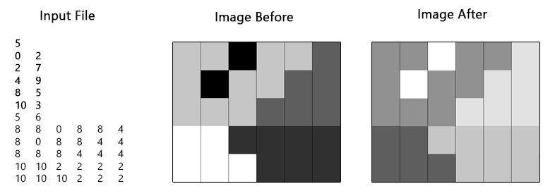

# Programming part 20/01/2020

*Flood fill*, also called *seed fill*, is an algorithm that determines the area connected to a given node in a multi-dimensional array. It is used in paint programs to fill connected, similarly-colored areas with a different color. Given a starting pixel, it first replaces the color of the current pixel. Then, it recurs onto all surrounding pixels, and it changes them to the replacement color. 

Images are stored into binary files with extension "img". Each image file stores only 16-bit unsigned integers, and it includes two sections:

* The first section starts with the number `n` of color substitutions, i.e., the number of color pairs, the program has to make. This number is followed by a sequence of `n` integer pairs. For each pair the first number is the current color, and the second one is the replacement one.

* The second part includes the image. It starts with two values specifying the size of the image, in terms of pixels along the row `R` and along the column `C`, respectively. Then, it includes a set of `(R . C)` integer values representing the color of each pixel within the image.

It is guaranteed that the input color set and the output color set are disjoint, and only one region for each color is present on the image. The following is an example of correct file (in textual form, to be readable), and the corresponding image before and after the application of the flood fill algorithm. 

The file first specifies that in the image the algorithm must perform 5 color substitutions (bold values): Color 0 with 1, color 2 with 7, etc. Then it reports the image size, and all pixel colors (non-bold values).

Write a WIN 32 program able to:

* Receive a string `S` and an integer value `N` on the command line. The string `S` specifies a directory path whereas the integer `N` indicates a number of threads.

* Run `N` threads performing flood fill in parallel on all images (files with extension "img") of the (flat) directory `S`. Recolored images must substitute original ones, i.e., no new file must be created.

* All flood fill threads must cooperate to apply the algorithm to all files. All threads have to proceed one file at a time, each one taking care of a different color substitution. In other words, for each image each thread must read the next color pair, search in the image the area to re-color, re-color the area and then get the next color pair to work on. When an image has been completely re-colored, all threads must be synchronized, i.e., they must wait for each other before dealing with the next image file in the directory.